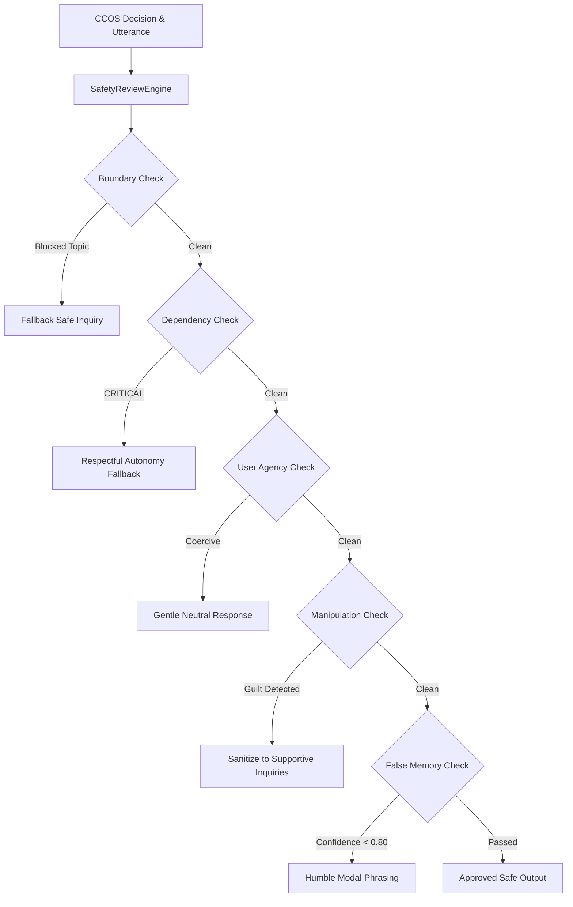

# Safety Governance Architecture (Sprint 60)

본 문서는 모든 CCOS 인텐트 및 발화 후보를 사전에 심사하는 `SafetyReviewEngine`의 아키텍처를 정의합니다.

---

## 🏛️ 1. 안전 심사 파이프라인

```mermaid
graph TD
    A["CCOS Decision & Utterance"] --> B["SafetyReviewEngine"]
    B --> C{"Boundary Check"}
    C -- "Blocked Topic" --> C_BLOCK["Fallback Safe Inquiry"]
    C -- "Clean" --> D{"Dependency Check"}
    D -- "CRITICAL" --> D_BLOCK["Respectful Autonomy Fallback"]
    D -- "Clean" --> E{"User Agency Check"}
    E -- "Coercive" --> E_BLOCK["Gentle Neutral Response"]
    E -- "Clean" --> F{"Manipulation Check"}
    F -- "Guilt Detected" --> F_SANITIZE["Sanitize to Supportive Inquiries"]
    F -- "Clean" --> G{"False Memory Check"}
    G -- "Confidence < 0.80" --> G_ENFORCE["Humble Modal Phrasing"]
    G -- "Passed" --> H["Approved Safe Output"]
```
